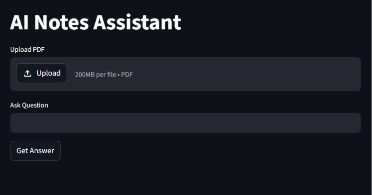
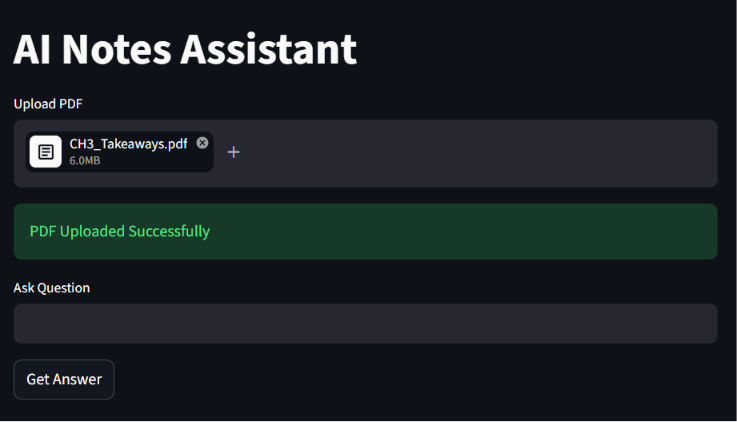
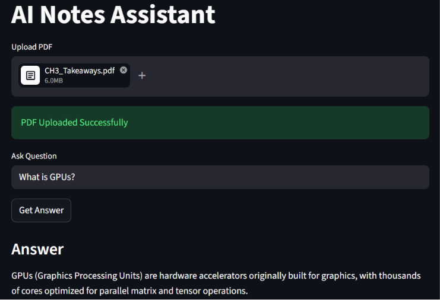

# AI Notes Assistant

## Overview

AI Notes Assistant is a Retrieval-Augmented Generation (RAG) application that allows users to upload PDF documents and ask questions based on the uploaded content.

The application extracts text from PDF files, splits the content into chunks, stores embeddings in ChromaDB, performs semantic search, and uses a Large Language Model (Groq Llama 3.1) to generate accurate answers from the uploaded documents.

---

## Features

* Upload PDF documents
* Extract text from PDFs
* Text chunking for efficient retrieval
* Semantic search using ChromaDB
* Retrieval-Augmented Generation (RAG)
* AI-powered question answering
* FastAPI backend
* Streamlit frontend

---

## Tech Stack

### Backend

* FastAPI
* Python

### Frontend

* Streamlit

### AI & RAG

* Groq (Llama 3.1)
* ChromaDB
* LangChain
* Sentence Transformers

### Document Processing

* PyPDF

---

## Application Screenshots

### Home Page



### PDF Upload



### Question and Answer



## How It Works

1. User uploads a PDF document.
2. Text is extracted from the PDF.
3. The extracted text is split into smaller chunks.
4. Chunks are stored in ChromaDB.
5. User asks a question.
6. ChromaDB retrieves the most relevant chunks.
7. Relevant context is sent to the Groq LLM.
8. The LLM generates an answer based on the retrieved content.

---

## Installation

### Clone Repository

```bash
git clone https://github.com/anishakomal/ai-notes-assistant.git
cd ai-notes-assistant
```

### Create Virtual Environment

```bash
python -m venv venv
```

### Activate Environment

Windows:

```bash
venv\Scripts\activate
```

### Install Dependencies

```bash
pip install -r requirements.txt
```

### Configure Environment Variables

Create a `.env` file in the project root:

```env
GROQ_API_KEY=your_groq_api_key
```

---

## Run Backend

```bash
uvicorn app.main:app --reload
```

Backend URL:

```text
http://127.0.0.1:8000
```

---

## Run Frontend

```bash
streamlit run streamlit_app.py
```

Frontend URL:

```text
http://localhost:8501
```

---

## Future Enhancements

* Multiple document support
* Chat history memory
* Persistent user sessions
* Advanced document chunking
* Hybrid search
* Cloud deployment
* Authentication and authorization
